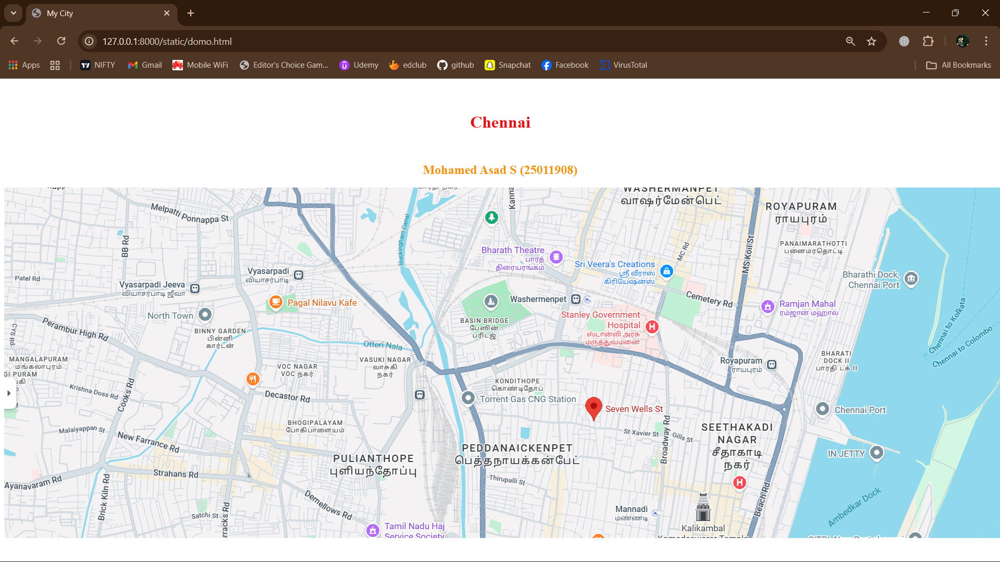

# Ex03 Places Around Me
## Date: 28.11.2025

## AIM
To develop a website to display details about the places around my house.

## DESIGN STEPS

### STEP 1
Create a Django admin interface.

### STEP 2
Download your city map from Google as an image.

### STEP 3
Insert the image using `````` tag and link it to the map.

### STEP 4
Using ```<map>``` tag name the map.

### STEP 5
Create clickable regions in the image using ```<area>``` tag.

### STEP 6
Write HTML programs for all the regions identified.

### STEP 7
Execute the programs and publish them.

## CODE
```
domo.html

<html>
    <head>
        <title>My City</title>
    </head>
    <body>
    <h1 align="center">
    <font color="red"><b>Chennai City</b></font>
    </h1>
    <h3 align="center">
        <font colour="blue"><b>Mohamed Asad S (25011908)</b></font>
    </h3>
    <center>
        
<map name="image-map">
    <area target="" alt="stanley goverment Hospital" title="stanley goverment Hospital" href="gh.html" coords="1073,283,1085,237,1122,197,1166,208,1218,227,1245,241,1254,288,1261,323,1159,300,1109,293" shape="poly">
    <area target="" alt="Royapuram" title="Royapuram" href="area3.html" coords="1397,378,1495,398,1517,319,1639,8,1472,-2" shape="poly">
    <area target="" alt="marina beach" title="marina beach" href="beach.html" coords="1713,2,1720,37,1696,52,1667,153,1655,206,1630,273,1618,347,1595,393,1591,425,1623,469,1608,493,1564,479,1544,530,1527,567,1522,609,1504,636,1502,658,1608,666,1691,666,1780,671,1904,671,1909,221,1900,10" shape="poly">
    <area target="" alt="basin bridge" title="basin bridge" href="bridge.html" coords="869,218,952,178,967,213,999,239,905,282" shape="poly">
    <area target="" alt="sri veera's creation" title="sri veera's creation" href="veeras.html" coords="1092,133,1279,133,1291,167,1269,182,1217,189,1136,186,1102,162" shape="poly">
</map>
    </center>
    </body>
</html>

gh.html

<html>
    <head>
        <title>Goverment Hospital</title>
    </head>
    <body bgcolor="lime">
        <h1 align="center">
            <font color="red"><b>Chennai City</b></font>
        </h1>
        <h3 align="center">
        <font color="blue"><b>Goverment Hospital</b></font>
        </h3>
        <hr size="3" color="red">
        <p align="justify">
            <font face="Georgia" size="5">
        A government hospital is a public healthcare institution funded and managed by the government, providing medical services to all citizens, often at low or no cost. These hospitals offer a wide range of services, from primary care like immunizations to specialized, secondary, and tertiary care, including emergency services, surgery, specialist consultations, and diagnostics. They serve as a crucial part of the public health system and often act as referral centers for smaller local clinics. 
            </font>
        </p>
    </body>
</html>

beach.html

<html>
    <head>
        <title>marina beach</title>
    </head>
    <body bgcolor="springgreen">
        <h1 align="center">
            <font color="red"><b>Chennai City</b></font>
        </h1>
        <h3 align="center">
        <font color="blue"><b>marina beach</b></font>
        </h3>
        <hr size="3" color="red">
        <p align="justify">
            <font face="Georgia" size="5">
Marina Beach is India's longest and the world's second-longest urban beach, stretching 13 kilometers along the Bay of Bengal in Chennai. It is a popular destination for strolling, watching sunrises, and visiting memorials and statues, though it is not safe for swimming due to strong undercurrents. The beach serves as a cultural and social hub, hosting events, festivals, and street food stalls, and is considered a prominent landmark of the city        </p>
    </body>
</html>

bridge.html

<html>
    <head>
        <title>basin bridge</title>
    </head>
    <body bgcolor="yellow">
        <h1 align="center">
            <font color="red"><b>Chennai City</b></font>
        </h1>
        <h3 align="center">
        <font color="blue"><b>basin bridge</b></font>
        </h3>
        <hr size="3" color="red">
        <p align="justify">
            <font face="Georgia" size="5">
The Basin Bridge is a historically significant locality and major transportation hub located in the northern part of Chennai, Tamil Nadu, India. The area's name is derived from the bridge originally built by the British over the Cooum River to connect two basins in the city.         </p>
    </body>
</html>

area3.html

<html>
    <head>
        <title>Royapuram</title>
    </head>
    <body bgcolor="yellow">
        <h1 align="center">
            <font color="red"><b>Chennai City</b></font>
        </h1>
        <h3 align="center">
        <font color="blue"><b>Royapuram</b></font>
        </h3>
        <hr size="3" color="red">
        <p align="justify">
            <font face="Georgia" size="5">
Royapuram is a historic and bustling neighborhood in North Chennai known for being the location of the first railway station in South India, which opened in 1856 and is the oldest surviving one in the subcontinent. It is a diverse area with a rich cultural heritage, having been home to various communities including Anglo-Indians and Parsis, and features landmarks like St. Peter's Church and a major fishing harbor. The area offers a blend of historical charm and modern urban living, with good connectivity via road and rail to other parts of the city            </font>
    </body>
</html>

veeras.html

<html>
    <head>
        <title>sri veera's creation</title>
    </head>
    <body bgcolor="aqua">
        <h1 align="center">
            <font color="red"><b>Chennai City</b></font>
        </h1>
        <h3 align="center">
        <font color="blue"><b>sri veera's creation</b></font>
        </h3>
        <hr size="3" color="red">
        <p align="justify">
            <font face="Georgia" size="5">
Sri Veera's Creations is a large textile retailer and wholesaler in Chennai, known for a wide collection of affordable, high-quality garments including silk, cotton, and designer sarees, as well as men's wear, readymade clothing, and home furnishings. Founded in 2009 by S.V. Balasubramani, it has grown from a small shop to a significant retail and wholesale business in the Chennai textile market. The company is also known for its bridal wear and has a reputation for both good quality and customer service, with a variety of options for both retail and wholesale buyers.         </p>
    </body>
</html>
```

## OUTPUT



## RESULT
The program for implementing image maps using HTML is executed successfully.
